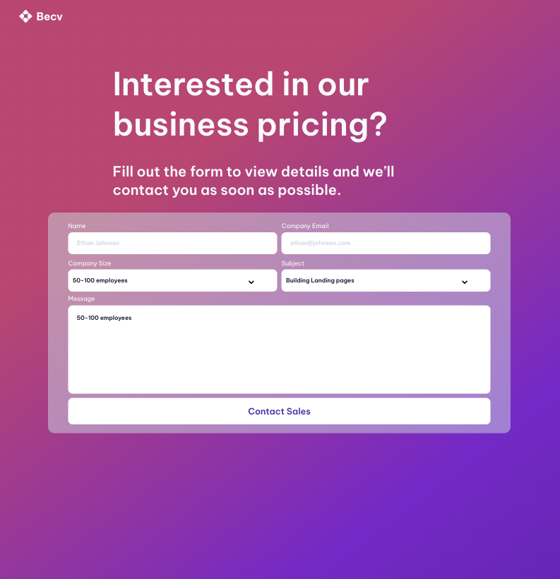
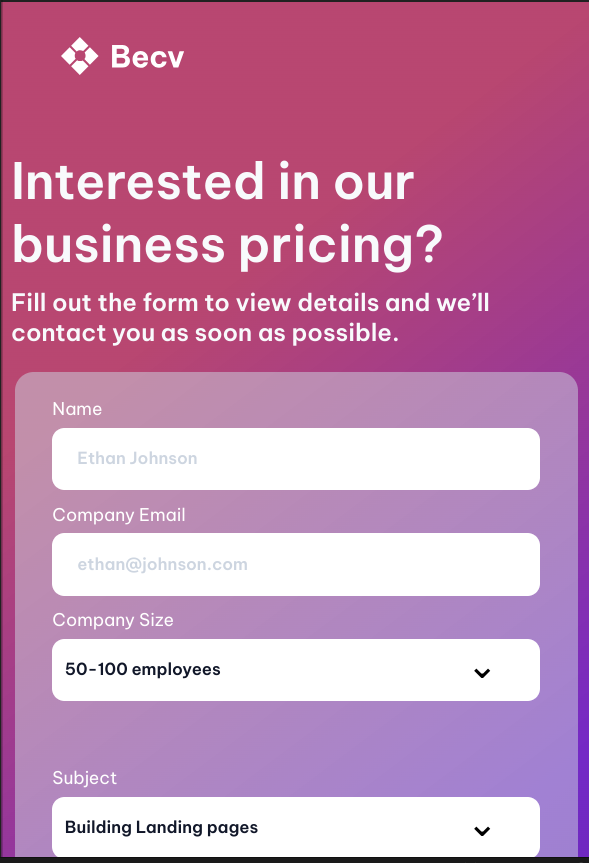

# Contact Page
- ### This challenge is to practice form and responsive design with HTML and CSS skills. The challenge is to create a contact page that you need to work with form, inputs, etc.

## User Stories
- ### Create a contact page that matches the given design.

- ### Use HTML to create the basic structure.

- ### Add icon, heading, description, form, input, dropdown, button,.. according to the design.

- ### Inputs should have placeholders.

- ### Dropdown should have at least 2 options, it's up to you which more options to add but the default must be same as in the design.

- ### Use CSS or CSS frameworks to style the card.

- ### The page should be responsive on different screen sizes.

- ### Deploy the solution and submit Repository URL and Demo URL.

## For Larg Scree

## For Small Screen
